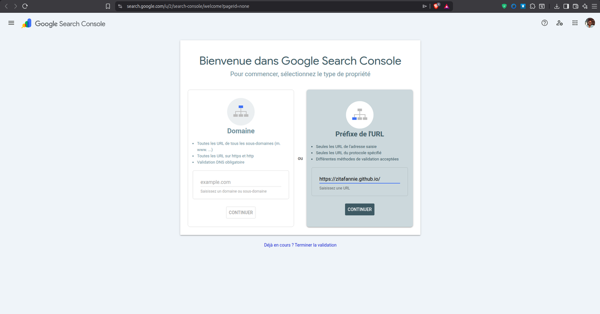
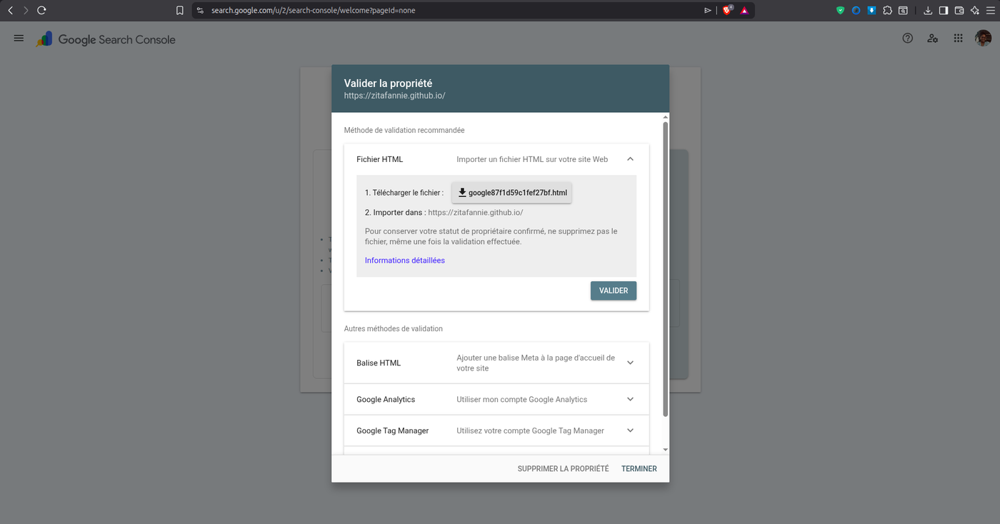
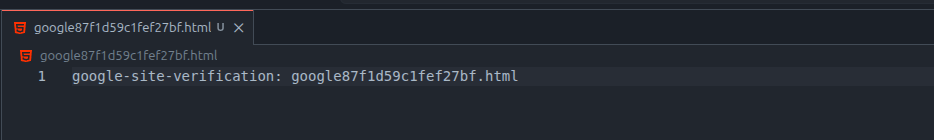
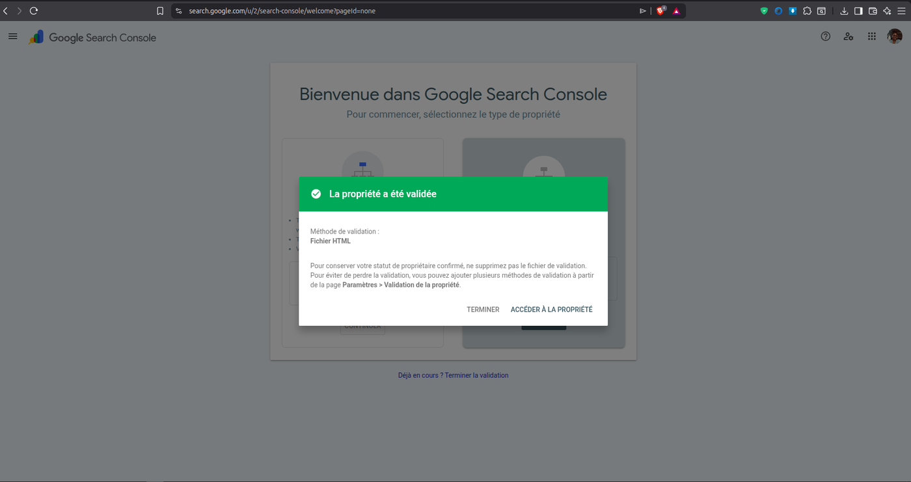
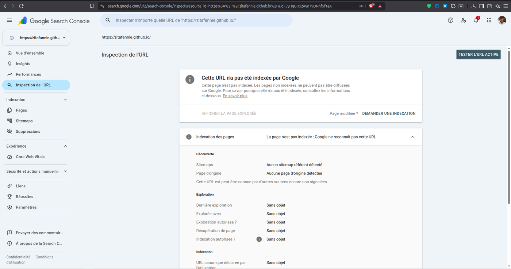
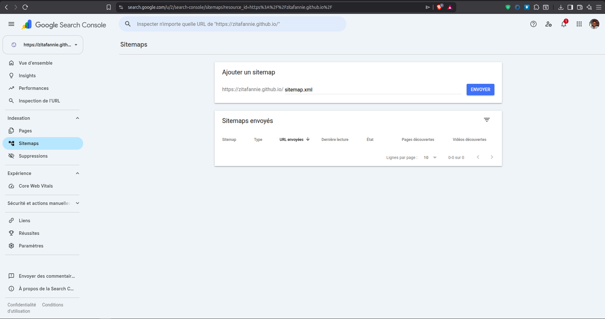
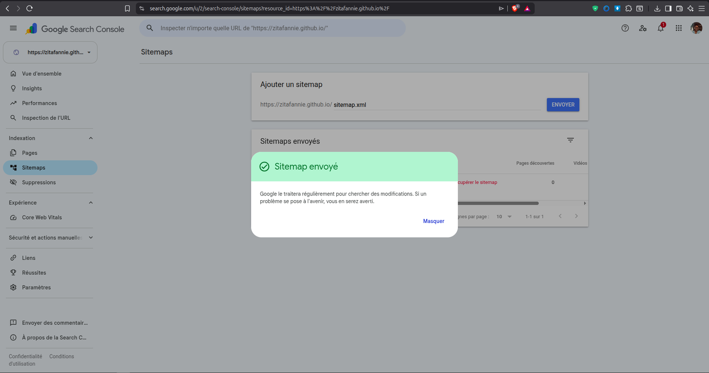
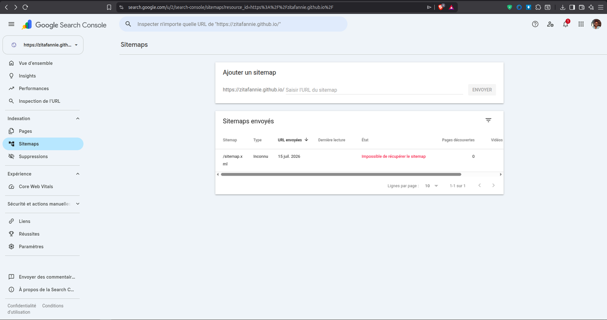
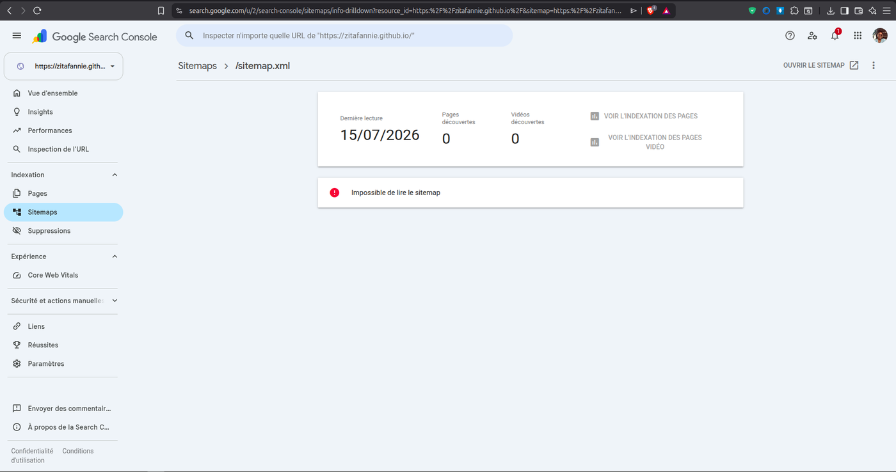

# Référencement Google (SEO) — Portfolio Zita Fannie

**Site :** https://zitafannie.github.io
**Objectif :** apparaître sur Google quand on cherche « Zita Fannie », « Zita Fannie
Andrianarivony » ou « chargée de communication Fianarantsoa ».
**Mise à jour :** 15 juillet 2026

---

## Sommaire

1. [Comment ça marche](#1-comment-ça-marche)
2. [La check-list SEO expliquée (problème → solution)](#2-la-check-list-seo-expliquée-problème--solution)
3. [Ce qui est déjà en place sur le site](#3-ce-qui-est-déjà-en-place-sur-le-site)
4. [Les étapes réalisées dans Google Search Console](#4-les-étapes-réalisées-dans-google-search-console)
5. [Le cas du sitemap : problème & solution](#5-le-cas-du-sitemap--problème--solution)
6. [Ce qu'il reste à faire](#6-ce-quil-reste-à-faire)
7. [Vérifier & délais réalistes](#7-vérifier--délais-réalistes)
8. [Check-list finale](#8-check-list-finale)

---

## 1. Comment ça marche

Pour qu'un site apparaisse sur Google, il faut **deux choses** :

1. **Un site bien préparé** pour les moteurs de recherche (SEO technique + contenu).
2. **Demander à Google de venir le lire** (indexation via Google Search Console).

Sans l'étape 2, Google peut mettre plusieurs **semaines** avant de trouver le site
seul. En la faisant, on passe à quelques **jours**.

> **Atout** : « Zita Fannie Andrianarivony » est un nom peu courant. Une fois le
> site indexé, il devrait ressortir facilement en première page sur ce nom.

---

## 2. La check-list SEO expliquée (problème → solution)

Voici la check-list SEO générale, expliquée point par point, avec le **problème**
typique et la **solution**, puis l'**état** sur ce portfolio.

Légende : ✅ en place — ⚠️ partiel / à surveiller — ❌ à faire.

### 2.1 Recherche de mots-clés
- **Principe :** identifier les termes que le public cible tape (outils : Google
  Keyword Planner, Ubersuggest, SEMrush). Viser des mots-clés **courts** et de
  **longue traîne**.
- **Problème :** viser des mots-clés trop génériques et trop concurrentiels.
- **Solution :** pour un **portfolio de personne**, le mot-clé nº 1 est le **nom**,
  complété par le métier et la ville : « Zita Fannie Andrianarivony »,
  « relations publiques Fianarantsoa », « communication numérique Madagascar ».
- **État : ✅** — le nom (et ses variantes) ainsi que le métier et la ville sont
  présents dans le titre, la description et les mots-clés de la page.

### 2.2 Optimisation on-page
- **Principe :** soigner les balises `<title>`, `<meta description>`, les titres
  hiérarchiques (H1/H2), des URL courtes, un contenu original de qualité, et le
  maillage interne.
- **Problème :** titres génériques, description absente, plusieurs H1, contenu trop
  court ou dupliqué.
- **Solution :** un seul H1 (le nom), des H2 par section, une description
  incitative avec les mots-clés, une URL propre.
- **État : ✅ / ⚠️**
  - `<title>` avec le nom complet ✅
  - `<meta description>` incitative avec mots-clés ✅
  - Titres H1/H2 structurés ✅
  - URL courte (`zitafannie.github.io/`) ✅
  - Contenu original ✅ — ⚠️ *longueur un peu juste (viser 500+ mots)*
  - Maillage interne : adapté à un site d'une page (la navigation relie les sections)

### 2.3 Optimisation technique
- **Principe :** vitesse de chargement, site responsive (mobile), HTTPS,
  `sitemap.xml` + `robots.txt` bien configurés, éviter le contenu dupliqué.
- **Problème :** pages lentes, images lourdes, site non adapté au mobile, pas de
  sitemap, contenu accessible via plusieurs adresses (doublons).
- **Solution :** compresser les images, charger le strict nécessaire, déclarer une
  adresse canonique, fournir un sitemap et un robots.txt.
- **État : ✅**
  - Vitesse : images compressées, chargement allégé, images en *lazy-loading*
  - Responsive (mobile-first) ✅
  - HTTPS ✅ (fourni par l'hébergement GitHub Pages)
  - `sitemap.xml` + `robots.txt` présents ✅
  - Balise `canonical` posée (anti-doublon) ✅
  - *À confirmer si besoin :* tester la vitesse sur https://pagespeed.web.dev

### 2.4 Backlinks (liens entrants)
- **Principe :** obtenir des liens depuis d'autres sites fiables (relations presse,
  annuaires de qualité, réseaux). Éviter le *netlinking* douteux (liens achetés).
- **Problème :** un site vers lequel **personne** ne pointe inspire peu confiance à
  Google et met plus de temps à être trouvé.
- **Solution :** placer l'adresse du portfolio dans les bios **LinkedIn**,
  **Instagram**, **Facebook** ; demander un lien à l'université (EMIT), à l'ONG et
  aux médias où Zita a travaillé.
- **État : ❌ à faire** — c'est le principal levier restant.

### 2.5 Expérience utilisateur (UX)
- **Principe :** navigation claire et intuitive, temps passé élevé / taux de rebond
  faible, appels à l'action bien placés, structure visuelle agréable.
- **Problème :** un site confus ou peu engageant fait fuir les visiteurs, ce que
  Google interprète négativement.
- **Solution :** menu clair, boutons d'action visibles, mise en page soignée.
- **État : ✅ / ⚠️**
  - Navigation collante + menu mobile ✅
  - Appels à l'action (« Me contacter », « Voir le parcours ») ✅
  - Structure visuelle soignée (images, titres, sections) ✅
  - ⚠️ Taux de rebond / temps passé : **mesurables uniquement avec Google Analytics** (voir 2.6)

### 2.6 Analyse et ajustement
- **Principe :** suivre les performances avec **Google Analytics** et **Google
  Search Console**, surveiller les positions, ajuster selon les données.
- **Problème :** sans mesure, impossible de savoir ce qui fonctionne.
- **Solution :** installer Search Console (positions, requêtes) et Analytics
  (visites, comportement).
- **État : ✅ / ❌**
  - Google Search Console : ✅ **fait** (voir section 4)
  - Google Analytics : ❌ **à faire** (pour visites, taux de rebond, temps passé)

---

## 3. Ce qui est déjà en place sur le site

Ces éléments sont intégrés au site — rien de plus à faire dessus :

| Élément | Rôle | État |
|---|---|---|
| Titre de page avec le **nom complet** | Correspondance avec la recherche « Zita Fannie Andrianarivony » | ✅ |
| **Meta description** | Le texte gris sous le titre dans Google | ✅ |
| **Mots-clés** (variantes du nom) | Zita Fannie / Andrianarivony Zita Fannie… | ✅ |
| Balise **canonical** | Adresse officielle, évite les doublons | ✅ |
| Balise **robots : index, follow** | Autorise le référencement | ✅ |
| **Open Graph + Twitter Card** | Bel aperçu au partage (Facebook, LinkedIn, WhatsApp) | ✅ |
| **Données structurées** (type *Person*) | Google comprend que c'est le portfolio d'une personne | ✅ |
| **robots.txt** | Autorise l'exploration + pointe le sitemap | ✅ |
| **sitemap.xml** | « Plan du site » pour Google | ✅ |
| **HTTPS** | Connexion sécurisée | ✅ |
| **Responsive** + vitesse | Adapté mobile, images optimisées | ✅ |

---

## 4. Les étapes réalisées dans Google Search Console

Google Search Console est l'outil **gratuit** de Google pour déclarer un site et
demander son indexation. Voici les étapes déjà effectuées.

### Étape 1 — Créer la propriété
Choisir le type **« Préfixe de l'URL »** (colonne de droite) et saisir
`https://zitafannie.github.io/`.


*Écran d'accueil : on choisit « Préfixe de l'URL » et on saisit l'adresse du site.*

### Étape 2 — Choisir la méthode de validation « Fichier HTML »
Google propose de télécharger un petit fichier de vérification
(`google87f1d59c1fef27bf.html`) à placer à la racine du site.


*Méthode recommandée : « Fichier HTML ». On télécharge le fichier fourni par Google.*

<details>
<summary>Autres captures de cette même étape</summary>


</details>

### Étape 3 — Déposer le fichier de vérification sur le site
Le fichier contient une seule ligne d'identification, et il est placé à la racine
du site (accessible à `https://zitafannie.github.io/google87f1d59c1fef27bf.html`).


*Le fichier de vérification : une seule ligne `google-site-verification: …`.*

> ⚠️ **Ne jamais supprimer ce fichier** : Google le vérifie régulièrement pour
> conserver la propriété confirmée.

### Étape 4 — La propriété est validée ✅
Une fois le fichier en ligne, Google confirme la propriété.


*Message vert « La propriété a été validée » — méthode : Fichier HTML.*

### Étape 5 — Inspecter l'URL et demander l'indexation
Dans **Inspection de l'URL**, on colle `https://zitafannie.github.io/`. Pour un site
neuf, Google affiche « Cette URL n'a pas été indexée » — c'est **normal**. On clique
alors sur **« Demander une indexation »** pour accélérer l'exploration.


*« Cette URL n'a pas été indexée » (normal pour un site neuf) → bouton « Demander une indexation ».*

### Étape 6 — Envoyer le sitemap
Dans le menu **Sitemaps**, on saisit `sitemap.xml` puis **Envoyer**.


*On saisit simplement `sitemap.xml` dans le champ, puis « Envoyer ».*


*Confirmation « Sitemap envoyé » : Google le traitera régulièrement.*

---

## 5. Le cas du sitemap : problème & solution

Après l'envoi, Search Console peut afficher une erreur.


*Dans la liste des sitemaps : état « Impossible de récupérer le sitemap ».*


*Détail du sitemap : « Impossible de lire le sitemap », 0 page découverte.*

### 🔴 Problème
Statut **« Impossible de lire / récupérer le sitemap »**, type « Inconnu »,
0 page découverte.

### 🟢 Solution
**Le fichier sitemap n'est pas en cause** — il est valide et accessible en ligne
(réponse correcte, format XML valide, type `application/xml`). Cette erreur est
**fréquente et temporaire** sur une propriété toute neuve. Deux causes possibles :

1. **Décalage de temps (le plus probable).** Sur un site que Google n'a pas encore
   exploré, le sitemap est souvent marqué en erreur juste après l'envoi, puis passe
   tout seul à **« Réussite »** au bout de quelques heures à quelques jours. Le
   traitement est **asynchrone**.
2. **Envoi pendant une phase où le fichier n'était pas encore disponible.** Une fois
   le fichier confirmé en ligne, il suffit de laisser Google réessayer.

**Que faire :**
- **Ne pas s'inquiéter et ne pas ré-envoyer en boucle.** Attendre.
- Optionnel : dans **Sitemaps**, supprimer la ligne `sitemap.xml` en erreur, puis la
  re-saisir et **Envoyer** à nouveau (utile si le premier envoi a eu lieu trop tôt).
- **Important :** l'indexation ne dépend **pas** du sitemap. Le vrai déclencheur est
  **« Demander une indexation »** (étape 5). Même si le sitemap reste un jour ou deux
  en erreur, la page peut être indexée.
- Si l'erreur persiste **au-delà de 3 jours**, vérifier que
  `https://zitafannie.github.io/sitemap.xml` s'ouvre bien dans le navigateur et
  affiche du XML, puis re-soumettre.

---

## 6. Ce qu'il reste à faire

Deux leviers principaux :

### A. Backlinks (action externe — la plus importante)
- Ajouter `https://zitafannie.github.io` dans la bio **LinkedIn**, **Instagram**
  (champ « site web »), **Facebook**.
- Demander un lien depuis l'université (EMIT), l'ONG et les médias où Zita a
  travaillé, si possible.

### B. Mesure & suivi
- **Google Analytics (GA4)** : créer une propriété sur https://analytics.google.com
  pour suivre visites, taux de rebond et temps passé.
- **Bing Webmaster Tools** (bonus, gratuit) : https://www.bing.com/webmasters —
  possibilité d'importer directement depuis Search Console.

### C. Contenu (optionnel)
- Enrichir légèrement les textes (viser 500+ mots) avec des formulations comme
  « communication et relations publiques à Fianarantsoa / Madagascar » pour
  renforcer les mots-clés locaux.

### D. Liens sociaux du site
- Renseigner les vraies adresses de profil dans le pied de page (elles renforcent
  aussi l'identité aux yeux de Google via les données structurées).

---

## 7. Vérifier & délais réalistes

**Vérifier l'indexation :** taper dans Google :

```
site:zitafannie.github.io
```

Si la page s'affiche, elle est **indexée**. Ensuite, chercher
« Zita Fannie Andrianarivony » : la page devrait remonter dans les premiers
résultats.

**Délais typiques :**
- Indexation après « Demander une indexation » : de quelques **heures** à quelques
  **jours**.
- Sitemap qui passe à « Réussite » : souvent 1 à 3 jours.
- Bon positionnement sur le nom propre : généralement **1 à 3 semaines**.

Le référencement se consolide avec le temps et les backlinks — ce n'est pas
instantané, mais un nom peu concurrentiel joue en votre faveur.

---

## 8. Check-list finale

- [x] Site préparé pour le SEO (titre, description, mots-clés, canonical, robots)
- [x] Données structurées (type *Person*) + Open Graph / Twitter Card
- [x] `robots.txt` + `sitemap.xml`
- [x] Google Search Console : propriété ajoutée
- [x] Google Search Console : propriété validée (fichier HTML)
- [x] Google Search Console : « Demander une indexation »
- [x] Google Search Console : sitemap envoyé
- [ ] Sitemap au statut « Réussite » *(attendre / re-soumettre si besoin)*
- [x] Google Analytics (GA4) installé (ID `G-N16PGG40C1`)
- [ ] Bing Webmaster Tools (bonus)
- [ ] Lien du site dans les bios LinkedIn / Instagram / Facebook
- [x] Vrais liens sociaux dans le pied de page (LinkedIn, Instagram, Facebook) + `sameAs`
- [ ] Vérifié avec `site:zitafannie.github.io`
